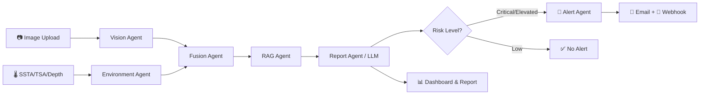

<p align="center">
  
  
  
  
  
  
</p>

<h1 align="center">🐠 CoralGuard AI</h1>
<p align="center">
  <strong>An AI-Powered Coral Reef Monitoring & Alert System</strong>
</p>
<p align="center">
  Upload reef imagery → AI classifies coral health → System generates scientific reports → Authorities are alerted automatically
</p>

---

## 📸 Screenshots

<table>
  <tr>
    <td><strong>Dashboard</strong></td>
    <td><strong>Analysis</strong></td>
  </tr>
  <tr>
    <td></td>
    <td></td>
  </tr>
  <tr>
    <td><strong>Reef Assistant (Chat)</strong></td>
    <td><strong>Knowledge Base</strong></td>
  </tr>
  <tr>
    <td></td>
    <td></td>
  </tr>
</table>

---

## 🧠 What Is CoralGuard AI?

CoralGuard AI is a **full-stack, multi-agent AI system** that monitors coral reef health using computer vision, environmental sensor data, and large language models. It is designed for marine biologists, park rangers, and conservation authorities to:

1. **Classify coral health** from underwater images (Healthy / Bleached / Dead)
2. **Analyze environmental parameters** (SSTA, TSA, depth, salinity)
3. **Generate structured scientific reports** grounded in SOPs and scientific guidelines
4. **Automatically alert marine authorities** when Critical or Elevated risk is detected
5. **Provide an AI-powered chat assistant** that references analysis results and knowledge base documents

---

## 🏗️ System Architecture

```
┌──────────────────────────────────────────────────────────────────┐
│                        FRONTEND (React + Vite)                   │
│  ┌──────────┐ ┌──────────┐ ┌──────┐ ┌────────┐ ┌─────────────┐ │
│  │Dashboard │ │ Analyze  │ │ Chat │ │ Alerts │ │Knowledge Base│ │
│  └────┬─────┘ └────┬─────┘ └──┬───┘ └───┬────┘ └──────┬──────┘ │
│       │            │          │         │              │        │
└───────┼────────────┼──────────┼─────────┼──────────────┼────────┘
        │            │          │         │              │
        ▼            ▼          ▼         ▼              ▼
┌──────────────────────────────────────────────────────────────────┐
│                     FastAPI Backend (REST API)                    │
│  /dashboard/stats  /analyze  /chat  /alerts  /rag/search         │
└──────────────────────────────┬───────────────────────────────────┘
                               │
                    ┌──────────▼──────────┐
                    │  ORCHESTRATOR AGENT  │
                    │  (Multi-Agent Core)  │
                    └──┬───┬───┬───┬───┬──┘
           ┌───────────┘   │   │   │   └───────────┐
           ▼               ▼   │   ▼               ▼
    ┌─────────────┐  ┌────────┐│┌────────┐  ┌─────────────┐
    │ Vision Agent│  │  Env   │││Fusion  │  │ Alert Agent │
    │(EfficientNet│  │ Agent  │││ Agent  │  │  (Webhook/  │
    │  B3 CNN)    │  │(DBSCAN)│││        │  │   Email)    │
    └──────┬──────┘  └───┬────┘│└───┬────┘  └──────┬──────┘
           │             │     │    │              │
           ▼             ▼     │    ▼              ▼
      Image →        Sensor → │  Risk →      ┌──────────┐
     Healthy/        Cluster   │ Level        │  Slack/  │
     Bleached/       Safe/     │ Low/         │  Email/  │
      Dead          Stressed/  │ Elevated/    │ Webhook  │
                   Anomalous   │ Critical     └──────────┘
                               │
                    ┌──────────▼──────────┐
                    │    RAG Agent        │
                    │ (Qdrant + FastEmbed)│
                    └──────────┬──────────┘
                               │
                    ┌──────────▼──────────┐
                    │   Report Agent      │
                    │  (Groq/OpenAI LLM)  │
                    │   JSON-structured   │
                    │   scientific report  │
                    └─────────────────────┘
```

### Agent Pipeline Flow



---

## 🗂️ Project Structure

```
MDM_backend/
├── docker-compose.yml          # One-command deployment
│
├── backend/                    # FastAPI Python backend
│   ├── app/
│   │   ├── main.py             # App entrypoint, CORS, middleware
│   │   ├── agents/
│   │   │   ├── agents.py       # Individual agent classes
│   │   │   └── orchestrator.py # Multi-agent orchestration pipeline
│   │   ├── alerting/
│   │   │   └── notifier.py     # Slack/Email/Webhook dispatcher
│   │   ├── api/
│   │   │   ├── deps.py         # Auth dependency injection
│   │   │   └── routes/
│   │   │       ├── auth.py           # JWT login/register
│   │   │       ├── analyze.py        # POST /analyze (full pipeline)
│   │   │       ├── predict.py        # POST /predict/image, /predict/environment
│   │   │       └── chat_rag_alerts.py # Chat, RAG search, Alerts, Dashboard stats
│   │   ├── core/
│   │   │   ├── config.py       # Pydantic settings (.env)
│   │   │   └── logging.py      # Structured logging
│   │   ├── db/
│   │   │   ├── base.py         # SQLAlchemy declarative base
│   │   │   ├── init_db.py      # Auto-create tables
│   │   │   └── session.py      # Engine with PostgreSQL → SQLite fallback
│   │   ├── ml/
│   │   │   ├── vision_service.py       # EfficientNet-B3 image classifier
│   │   │   ├── environment_service.py  # DBSCAN/HDBSCAN clustering
│   │   │   └── fusion_service.py       # Vision + Env → Risk level
│   │   ├── models/
│   │   │   └── entities.py     # SQLAlchemy models (User, Session, Analysis, Alert, etc.)
│   │   ├── rag/
│   │   │   ├── qdrant_service.py  # Vector search + category filtering
│   │   │   ├── ingest.py          # Knowledge base ingestion script
│   │   │   └── data/              # 📚 Scientific knowledge documents
│   │   │       ├── coral_bleaching_sop.txt
│   │   │       ├── authority_contacts.txt
│   │   │       ├── precautionary_measures.txt
│   │   │       ├── reef_ecology_basics.txt
│   │   │       └── emergency_response.txt
│   │   ├── schemas/
│   │   │   └── common.py      # Pydantic request/response models
│   │   ├── services/
│   │   │   ├── llm_service.py   # Groq/OpenAI with JSON-mode reports + conversational chat
│   │   │   ├── chat_service.py  # Context-aware chat (injects latest analysis)
│   │   │   └── alert_service.py # Alert dispatch + dashboard stats queries
│   │   └── utils/
│   │       └── rate_limiter.py  # In-memory rate limiting
│   ├── .env                    # Configuration (API keys, DB URL, etc.)
│   └── requirements.txt
│
└── frontend/                   # React + TypeScript + Vite
    ├── src/
    │   ├── App.tsx              # Route definitions
    │   ├── main.tsx             # React entrypoint
    │   ├── index.css            # Glassmorphism design system
    │   ├── api/
    │   │   └── client.ts        # Axios client with JWT auth
    │   ├── components/
    │   │   ├── Layout.tsx       # Sidebar + topbar navigation
    │   │   ├── AuthGuard.tsx    # Protected route wrapper
    │   │   └── ui/              # Reusable components (Button, Card, Input)
    │   ├── pages/
    │   │   ├── Login.tsx        # Authentication
    │   │   ├── Dashboard.tsx    # Live stats + recent analyses
    │   │   ├── Analyze.tsx      # Image upload → AI report → alert status
    │   │   ├── Chat.tsx         # Context-aware Reef Assistant
    │   │   ├── Alerts.tsx       # Alert timeline with status badges
    │   │   └── Rag.tsx          # Knowledge Base browser + search
    │   ├── types/
    │   │   └── index.ts         # TypeScript interfaces
    │   └── lib/
    │       └── utils.ts         # Tailwind merge utility
    └── package.json
```

---

## 🔬 How It Works

### 1. Image Classification (Vision Agent)

The system uses a fine-tuned **EfficientNet-B3** convolutional neural network trained on coral reef imagery. When a user uploads an image:

1. The image is resized to 224×224 and normalized using ImageNet statistics
2. The model outputs probabilities for three classes: **Healthy**, **Bleached**, **Dead**
3. A confidence threshold (65%) flags low-confidence predictions for manual review

### 2. Environmental Analysis (Environment Agent)

Environmental sensor data (SSTA, TSA, depth) is processed through:

1. A **Standard Scaler** (fitted on training data)
2. A **DBSCAN/HDBSCAN clustering model** that classifies conditions as **Safe**, **Stressed**, or **Anomalous**
3. Rule-based risk scoring (e.g., SSTA > 1.5°C adds +0.35 risk)

### 3. Multi-Modal Fusion (Fusion Agent)

The fusion engine combines vision and environment outputs into a unified risk assessment:

| Vision Output | Env Cluster | → Fusion Risk |
|---|---|---|
| Healthy | Safe | **Low** |
| Bleached | Stressed | **Elevated** |
| Dead | Anomalous | **Critical** |
| Bleached | Anomalous | **Critical** |

### 4. RAG-Augmented Report Generation

The system retrieves relevant documents from the **Qdrant vector database** using semantic search:

1. Query is constructed from analysis state: `"coral reef Bleached risk Critical SSTA 1.8 TSA 9..."`
2. Top-5 matching chunks are retrieved from the knowledge base (SOPs, precautions, contacts)
3. These are injected into the LLM prompt as **grounding context**
4. The LLM (**Groq Llama 3.3 70B** or **OpenAI GPT-4o-mini**) generates a JSON-structured report with:
   - `summary` — Brief overview
   - `scientific_reasoning` — Detailed analysis citing the guidelines
   - `recommended_action` — Specific steps for authorities
   - `precautionary_measures` — Risk-level-appropriate precautions
   - `authority_action_needed` — Boolean flag for Critical events

### 5. Automated Alerting

When risk is **Critical** or **Elevated with high confidence (≥80%)**:

1. An **email alert** is dispatched to the configured marine authority
2. A **webhook alert** (Slack Block Kit format) is sent to the configured endpoint
3. Alerts are persisted in the database with idempotency keys to prevent duplicates
4. Alert status (sent/failed) is tracked and displayed on the frontend

### 6. Context-Aware Chat (Reef Assistant)

The chat system:

1. Fetches the user's **latest analysis** from the database
2. Retrieves relevant **knowledge base documents** via RAG
3. Passes both as context to the LLM, so the AI can say: *"Based on your latest scan showing Bleached coral at 87% confidence, I recommend..."*

---

## 🚀 Getting Started

### Prerequisites

- **Python 3.12+** with pip
- **Node.js 18+** with npm
- **Groq API Key** (free at [console.groq.com](https://console.groq.com)) OR **OpenAI API Key**
- **Qdrant Cloud** account (free tier at [cloud.qdrant.io](https://cloud.qdrant.io)) — or run Qdrant locally via Docker

### Option 1: Docker Compose (Recommended)

```bash
cd MDM_backend
cp backend/.env.example backend/.env
# Edit backend/.env with your API keys

docker compose up --build
```

- Frontend: http://localhost:5173
- Backend API: http://localhost:8000/docs

### Option 2: Manual Setup

#### Backend

```bash
cd MDM_backend/backend

# Create virtual environment
python -m venv .venv
.venv\Scripts\activate      # Windows
# source .venv/bin/activate  # macOS/Linux

# Install dependencies
pip install -r requirements.txt

# Configure environment
cp .env.example .env
# Edit .env with your GROQ_API_KEY, QDRANT_URL, QDRANT_API_KEY

# Start the server
python -m uvicorn app.main:app --reload --host 0.0.0.0 --port 8000
```

#### Ingest Knowledge Base (Required — run once)

```bash
python -m app.rag.ingest --force
```

This populates the Qdrant vector database with scientific SOPs, authority contacts, precautionary measures, reef ecology references, and emergency protocols.

#### Frontend

```bash
cd MDM_backend/frontend

npm install
npm run dev
```

Open http://localhost:5173 in your browser.

### Default Credentials

| Field | Value |
|---|---|
| Email | `admin@coralguard.ai` |
| Password | `password123` |

---

## ⚙️ Configuration

All configuration is managed via `backend/.env`:

| Variable | Description | Default |
|---|---|---|
| `GROQ_API_KEY` | Groq API key for LLM | Required |
| `GROQ_MODEL` | Groq model name | `llama-3.3-70b-versatile` |
| `OPENAI_API_KEY` | OpenAI API key (fallback) | Optional |
| `QDRANT_URL` | Qdrant Cloud URL | Required for RAG |
| `QDRANT_API_KEY` | Qdrant API key | Required for RAG |
| `MODEL_PATH` | Path to EfficientNet-B3 `.keras` model | `models/efficientnet_b3_coral_v1.keras` |
| `HDBSCAN_MODEL_PATH` | Path to clustering model `.pkl` | `models/dbscan_model.pkl` |
| `SCALER_PATH` | Path to StandardScaler `.pkl` | `models/scaler.pkl` |
| `ALERT_EMAIL_TO` | Email for authority alerts | `authority@example.gov` |
| `ALERT_WEBHOOK_URL` | Slack/Teams webhook URL | Optional |
| `DATABASE_URL` | PostgreSQL connection string | Falls back to SQLite |

---

## 📡 API Endpoints

| Method | Endpoint | Description |
|---|---|---|
| `POST` | `/api/v1/auth/register` | Register a new user |
| `POST` | `/api/v1/auth/login` | Login (returns JWT) |
| `POST` | `/api/v1/analyze` | Full analysis pipeline (image + env params) |
| `POST` | `/api/v1/predict/image` | Vision-only classification |
| `POST` | `/api/v1/predict/environment` | Environment-only clustering |
| `POST` | `/api/v1/chat` | Context-aware chat with Reef Assistant |
| `POST` | `/api/v1/rag/search` | Semantic search over knowledge base |
| `GET`  | `/api/v1/rag/categories` | Browse knowledge base by category |
| `GET`  | `/api/v1/alerts` | Get user's alert history |
| `GET`  | `/api/v1/dashboard/stats` | Dashboard statistics |
| `GET`  | `/api/v1/history/{session_id}` | Session history (messages + analyses) |
| `GET`  | `/api/v1/reports/{analysis_id}` | Retrieve a specific analysis report |
| `GET`  | `/health` | Health check |

---

## 🛡️ Tech Stack

| Layer | Technology |
|---|---|
| **Frontend** | React 18, TypeScript, Vite, TailwindCSS, Framer Motion, Lucide Icons |
| **Backend** | FastAPI, Python 3.12, SQLAlchemy 2.0, Pydantic v2 |
| **ML / Vision** | TensorFlow, EfficientNet-B3, PIL |
| **Clustering** | scikit-learn DBSCAN / hdbscan |
| **LLM** | Groq (Llama 3.3 70B) or OpenAI (GPT-4o-mini) with JSON mode |
| **RAG** | Qdrant Cloud, FastEmbed (BAAI/bge-small-en-v1.5) |
| **Database** | PostgreSQL 16 (with SQLite fallback) |
| **Auth** | JWT (PyJWT + bcrypt) |
| **Alerting** | httpx (async webhooks), Slack Block Kit format |
| **Deployment** | Docker Compose (backend + frontend + PostgreSQL + Redis) |

---

## 📊 Knowledge Base Documents

The RAG system is powered by 5 curated scientific documents:

| Document | Content |
|---|---|
| `coral_bleaching_sop.txt` | Detection procedures, risk classification thresholds, immediate response actions, post-event monitoring |
| `authority_contacts.txt` | GBRMPA, NOAA, Reef Check contacts with escalation protocols and report templates |
| `precautionary_measures.txt` | Risk-level-specific measures (tourism management, fishing restrictions, coral rescue, shade structures) |
| `reef_ecology_basics.txt` | SSTA/TSA thresholds, bleaching science, coral classification definitions |
| `emergency_response.txt` | 4-phase emergency protocol (0-2hrs, 2-24hrs, 24hrs-2wks, recovery) with communication templates |

---

## 🤝 Contributing

1. Fork the repository
2. Create your feature branch (`git checkout -b feature/amazing-feature`)
3. Commit your changes (`git commit -m 'Add amazing feature'`)
4. Push to the branch (`git push origin feature/amazing-feature`)
5. Open a Pull Request

---

## 📄 License

This project is for educational and research purposes. Please ensure compliance with local marine conservation regulations when deploying in production.

---

<p align="center">
  Built with 🐠 for coral reef conservation
</p>
