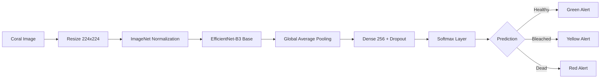
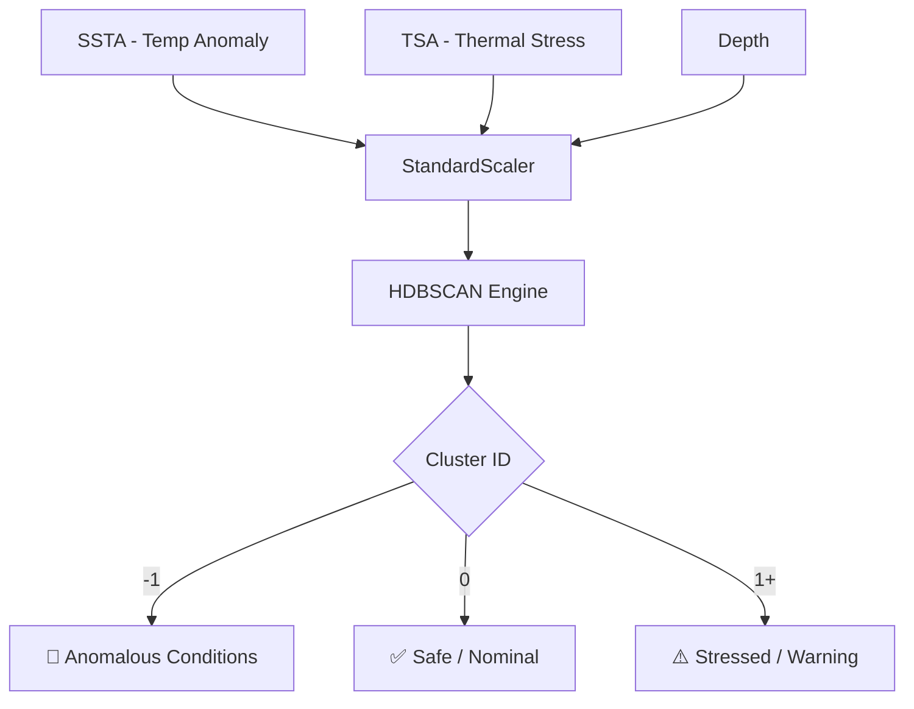
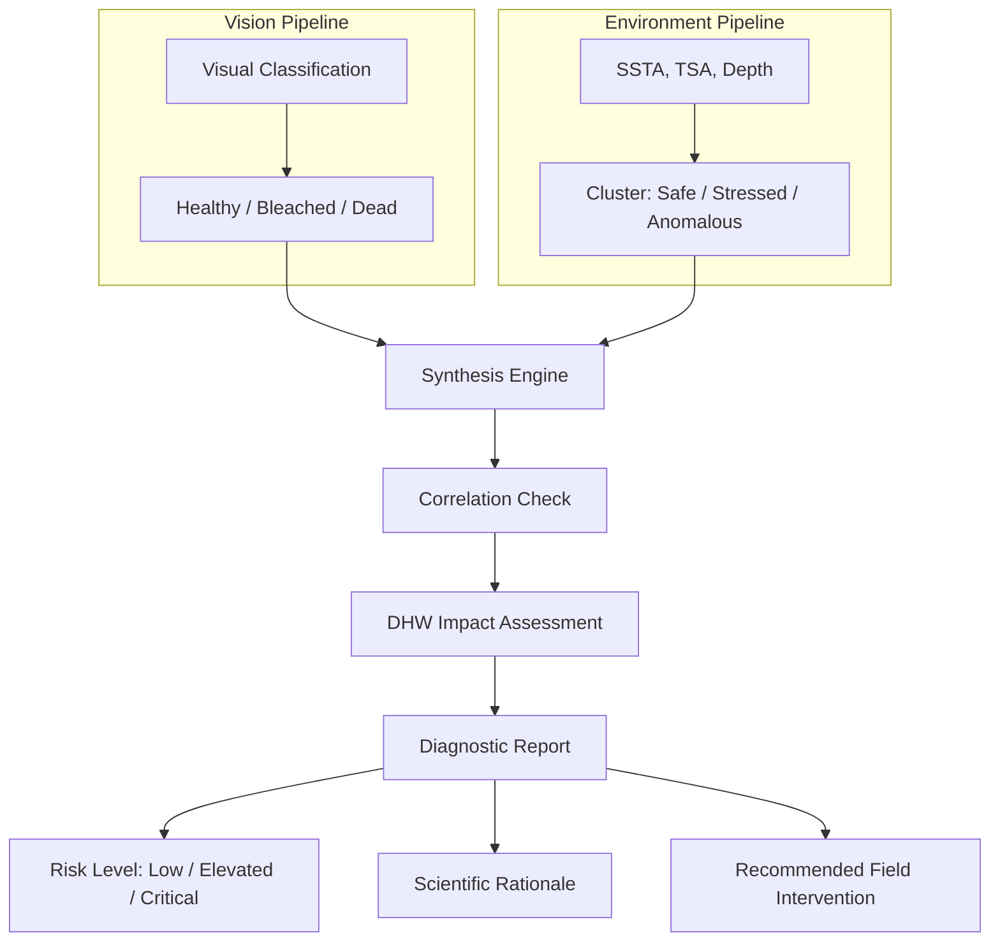

# 🌊 CoralGuard AI: Multimodal Marine Ecosystem Monitoring

[](https://www.python.org/downloads/)
[](https://tensorflow.org)
[](https://streamlit.io)
[](https://arxiv.org/abs/1905.11946)

**CoralGuard AI** is a state-of-the-art, multimodal marine ecosystem monitoring platform. By bridging localized coral imagery with regional environmental telemetry, CoralGuard provides a holistic, real-time assessment of reef health, enabling proactive conservation efforts through advanced Artificial Intelligence.

---

## 🚀 Key Features

- **🔬 Deep Vision Inference:** Real-time coral health classification (Healthy, Bleached, Dead) using a fine-tuned EfficientNet-B3 model.
- **🌊 Environmental Anomaly Detection:** Unsupervised clustering of Sea Surface Temperature (SSTA) and Thermal Stress (TSA) to flag high-risk marine conditions.
- **🧬 Multimodal Synthesis Engine:** Deterministic fusion of visual and environmental data streams into a unified diagnostic report with risk level, scientific rationale, and actionable field interventions.
- **📊 Comparative Analytics:** Deep-dive into model performance metrics, training history, and architectural benchmarks.
- **🎨 Premium UI/UX:** A bespoke, underwater-themed dashboard built with Streamlit and Plotly for intuitive data exploration.

---

## 🏗️ System Architecture

CoralGuard AI utilizes a dual-pipeline architecture to process both visual and environmental data streams.

### 1. Vision Pipeline (Supervised Learning)
The vision pipeline is the core of our image classification engine. It leverages **Transfer Learning** to extract complex features from coral imagery.



- **Architecture:** EfficientNet-B3 (pre-trained on ImageNet)
- **Top-1 Accuracy:** 86.14% (Validation)
- **Optimization:** Adam Optimizer, Label Smoothing (0.1), Dropout (0.3)

### 2. Environmental Pipeline (Unsupervised Learning)
The environmental pipeline acts as an early-warning system by monitoring the "climate" of the reef.



- **Algorithm:** HDBSCAN (Hierarchical Density-Based Spatial Clustering of Applications with Noise)
- **Features:** Sea Surface Temperature Anomaly, Thermal Stress Anomaly, Depth
- **Advantage:** Unlike k-means, HDBSCAN doesn't require a pre-defined cluster count and effectively identifies outliers (noise) as anomalies.

### 3. Synthesis Engine (Multimodal Fusion)
The Synthesis Engine is the brain that correlates outputs from both pipelines to produce a unified, science-grade diagnostic.



**Analysis Protocol:**
1. **Correlation Check:** Cross-references visual health status with environmental cluster state (e.g., Bleached + Anomalous = Thermal-Stress-Induced Bleaching).
2. **Impact Assessment:** Severity is derived from NOAA Degree Heating Weeks (DHW) thresholds: `<4 DHW → Low`, `4–8 DHW → Elevated`, `≥8 DHW → Critical`.
3. **Actionable Intelligence:** Generates one specific, deployable conservation intervention.

---

## 📂 Project Structure

```text
coralguard_app/
├── app.py                      # Main Streamlit entry point & routing
├── requirements.txt            # Project dependencies
├── components/                 # Modular UI Pages
│   ├── home.py                 # Dashboard landing & project vision
│   ├── inference.py            # Real-time Multimodal Inference Engine
│   └── comparative_analysis.py # Deep model performance analytics
├── utils/                      # Helper modules
│   ├── model_loader.py         # Thread-safe loading for Keras & Pickle models
│   ├── synthesis_engine.py     # Deterministic multimodal fusion engine
│   └── ui_utils.py             # Custom CSS injection & branding
└── assets/                     # Brand assets & styling
```

---

## 📈 Model Performance

| Model | Val Accuracy | Val Loss | Parameters | Status |
| :--- | :--- | :--- | :--- | :--- |
| **EfficientNet-B3** | **86.14%** | **0.5521** | **~12.3M** | **Production** |
| Baseline CNN | 77.53% | 0.7066 | ~112K | Evaluation |
| Baseline ANN | 50.36% | 11.010 | ~38.5M | Deprecated |

---

## 🛠️ Installation & Usage

### 1. Clone the Repository
```bash
git clone https://github.com/yourusername/coralguard-ai.git
cd coralguard-ai
```

### 2. Set Up Virtual Environment
```bash
python -m venv .venv
source .venv/bin/activate  # Windows: .venv\Scripts\activate
```

### 3. Install Dependencies
```bash
pip install -r coralguard_app/requirements.txt
```

### 4. Run the Application
```bash
cd coralguard_app
streamlit run app.py
```

---

## 🧬 Scientific Context

Coral reefs are the "rainforests of the sea," supporting 25% of all marine life. However, they are under severe threat from global warming.
- **Bleaching:** Occurs when corals expel the algae living in their tissues due to temperature stress.
- **CoralGuard AI** helps marine biologists monitor these events by automating the identification of stress markers from field imagery and regional satellite telemetry.

---

## 🤝 Contributing

Contributions are welcome! Whether it's optimizing the model, adding new environmental indicators, or improving the UI, feel free to open a PR.

---

## 📜 License

Distributed under the MIT License. See `LICENSE` for more information.

---

<p align="center">
  Developed with ❤️ for Marine Conservation
</p>
